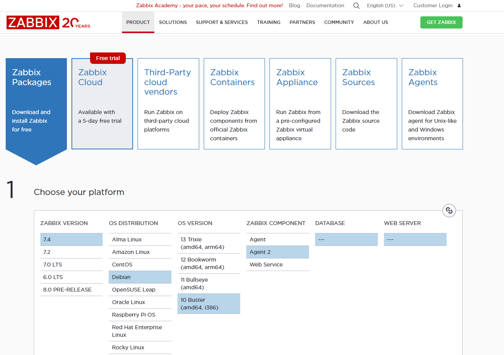
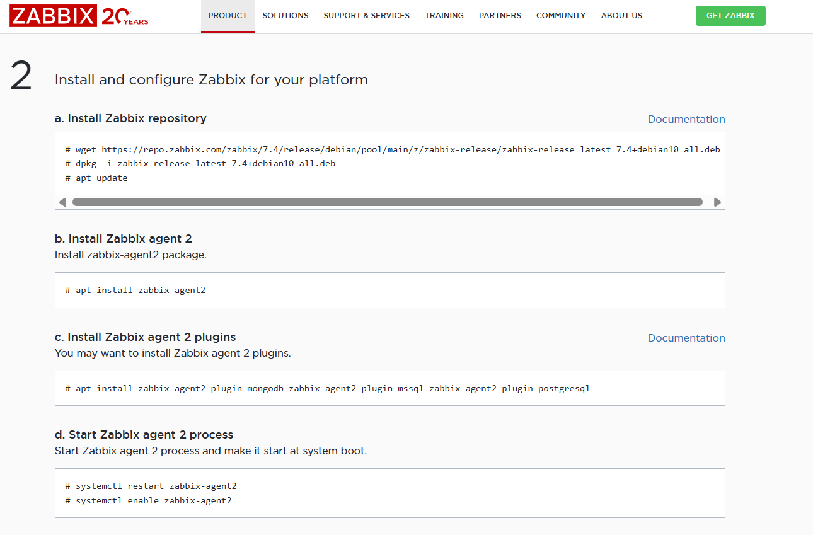
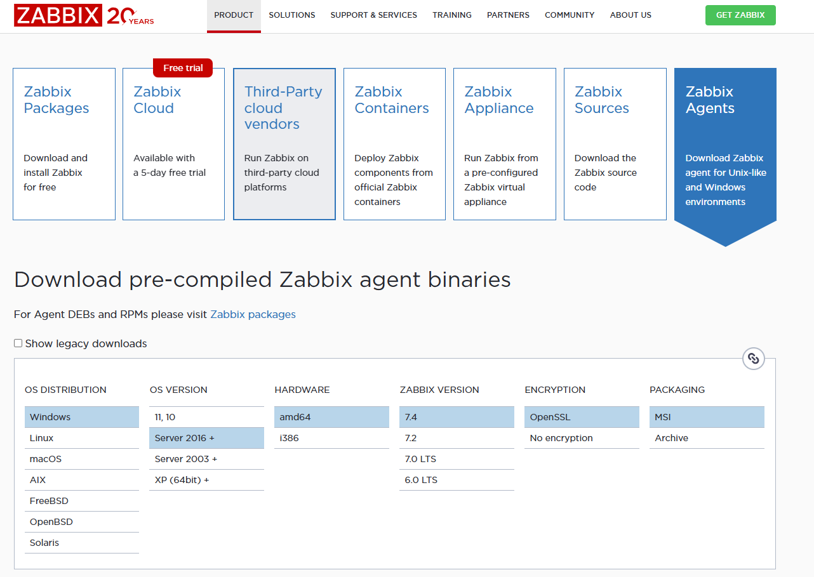
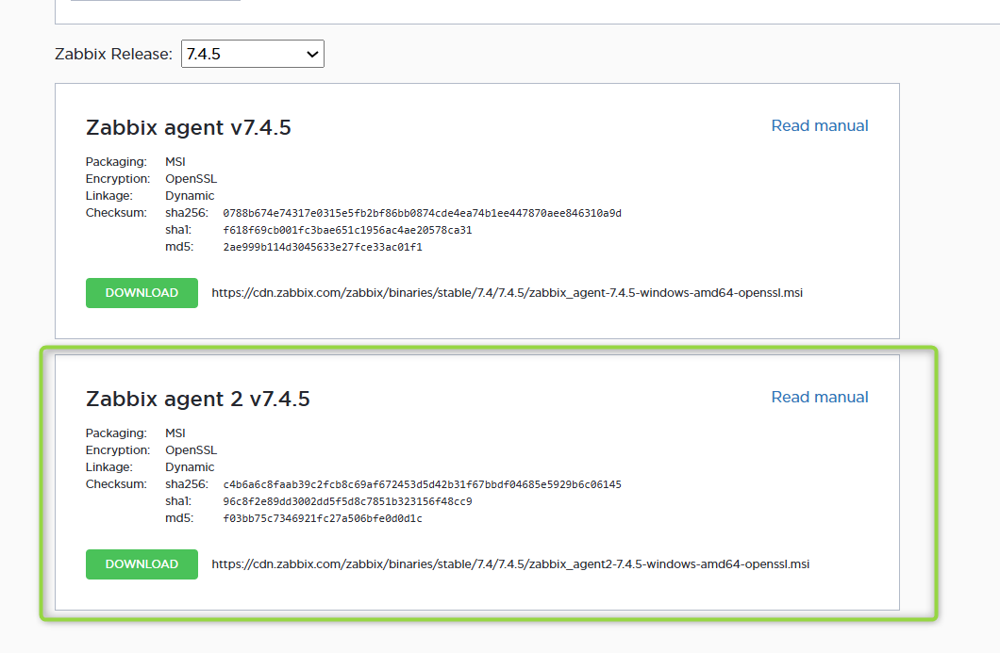
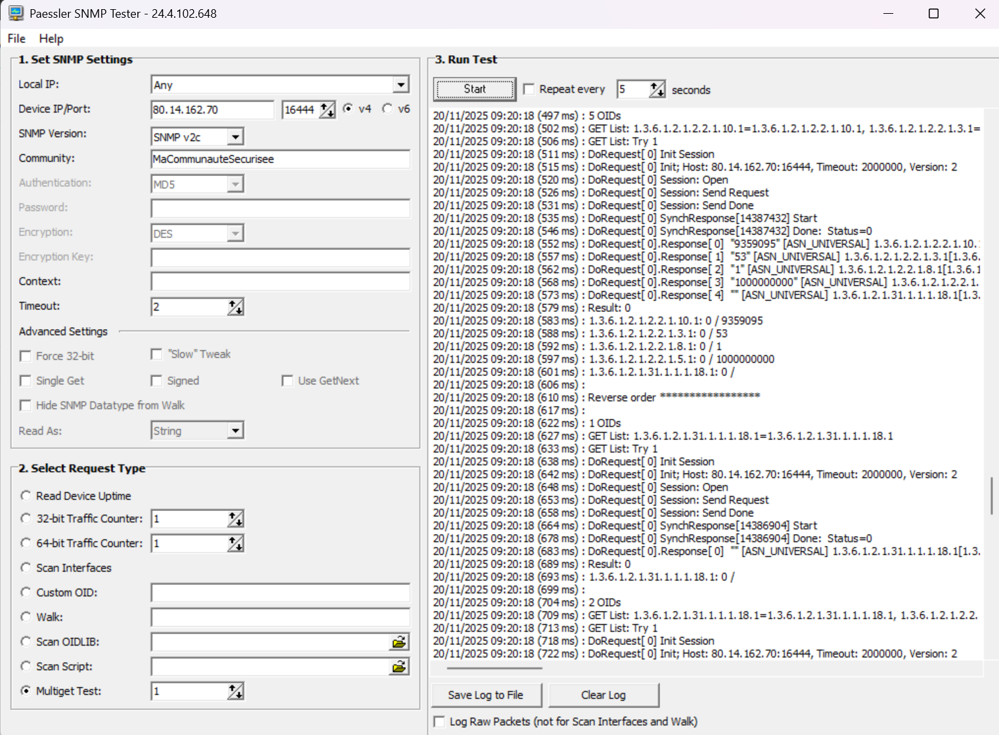

# **📘 Jour 2 - Atelier 2 : Zabbix 7.4 – Agent 2 - SNMP - LLD**

**Objectif :** Comprendre les concepts modernes (Agent 2, Mode Actif, LLD) et les appliquer sur une infrastructure hétérogène (Linux, Windows, Réseau).

---

## **1️⃣ Module 1 : L'Ère de l'Agent 2 & Migration Linux**

### **🧠 Concept : Pourquoi passer à l'Agent 2 ?**

Avant de migrer, comprenons l'évolution.

* **Zabbix Agent (Legacy \- C) :** L'ancien standard. Léger et stable, mais limité.  
* **Zabbix Agent 2 (Moderne \- Go) :** C'est la nouvelle norme. Écrit en langage **Go**, il est beaucoup plus performant car il gère les vérifications en parallèle (un check lent ne bloque pas les autres). De plus, il supporte nativement des **plugins** (PostgreSQL, Docker, MongoDB) sans scripts complexes.

### **🧠 Concept : Passif vs Actif (Le choix crucial)**

* **Mode Passif (Serveur ➔ Agent) :** Le serveur demande "Quelle est ta CPU ?". L'agent répond. Simple, mais bloqué par le NAT.  
* **Mode Actif (Agent ➔ Serveur) :** L'agent contacte le serveur : *"Bonjour, donne-moi ma configuration"*. Le serveur envoie la liste des items. L'agent envoie ensuite les données de lui-même (Push).  
  * *Avantage :* Traverse les pare-feux/NAT et soulage le serveur Zabbix.  
  * *Bonne pratique :* Toujours privilégier le **mode Actif**.

Voici le texte formaté en Markdown, prêt à être intégré dans votre support de cours. J'ai ajouté des éléments visuels (code blocks, listes, citations) pour faciliter la lecture par les apprenants.

-----

### 🔌 Mode Passif ou Mode Actif ?

Pour l'Agent 2 (que ce soit sur Linux ou Windows), la recommandation est claire :

> **🏆 Le Mode ACTIF est le grand gagnant.**
>
> C'est la recommandation officielle pour 95% des infrastructures modernes, surtout avec Zabbix 7.4.

Voici pourquoi, expliqué simplement pour vos apprenants :

#### 1\. La raison n°1 : Les Pare-feux et le NAT

C'est l'argument décisif.

  * **Mode Passif** (Serveur ➔ Agent) :

      * Le serveur Zabbix essaie d'entrer chez le client (`Serveur -> Port 10050`).
      * 🔴 **Problème :** Si votre Windows ou Linux est derrière une Box Internet, un routeur NAT, ou dans le Cloud (AWS/Azure), ça bloque. Vous devez ouvrir des ports et faire du "Port Forwarding" partout.

  * **Mode Actif** (Agent ➔ Serveur) :

      * L'agent sort vers le serveur (`Agent -> Port 10051`).
      * 🟢 **Avantage :** La plupart des pare-feux autorisent le trafic sortant par défaut. **Ça marche immédiatement**, sans toucher au réseau.

#### 2\. La "Mémoire Tampon" (Buffer) - Vital \!

C'est une fonctionnalité exclusive au mode Actif.

  * **Scénario :** Votre connexion internet coupe pendant 1 heure.
  * **En Passif :** Le serveur n'a pas pu contacter l'agent. Il y a un "trou" dans les graphiques. La donnée est perdue à jamais.
  * **En Actif :** L'Agent 2 stocke les données en mémoire (Buffer). Dès que la connexion revient, il envoie tout l'historique d'un coup. **Aucune perte de données.**

#### 3\. La Performance (Scalabilité)

  * **En Passif :** Le serveur Zabbix doit gérer un chronomètre pour chaque hôte (*"Est-ce que c'est l'heure de demander la CPU à Windows ?"*). Si le réseau est lent, le serveur "attend" et ses processus s'engorgent.
  * **En Actif :** Le serveur envoie juste la liste des courses (la config) au début. Ensuite, c'est l'Agent qui gère son propre timing. Le serveur ne fait que "recevoir et stocker". C'est beaucoup plus léger pour le serveur Zabbix.

-----

### ⚠️ Attention à la configuration

Pour que le mode Actif fonctionne, il faut impérativement vérifier deux choses :

#### 1\. Côté Fichier de config (`zabbix_agent2.conf`)

Vous devez remplir le champ `ServerActive`.

```ini
# Le mode Passif utilise ce champ (Optionnel si vous ne faites que de l'actif)
Server=192.168.1.10

# Le mode Actif utilise OBLIGATOIREMENT ce champ
ServerActive=192.168.1.10

# Indispensable en Actif : Le nom doit être EXACTEMENT celui dans l'interface Web
Hostname=WIN-SRV-01
```

#### 2\. Côté Interface Web (Templates)

C'est l'erreur classique des débutants. Si vous configurez l'agent en actif mais que vous appliquez un template passif, rien ne remontera.

  * ❌ **Ne prenez pas :** `Windows by Zabbix agent` (Souvent passif par défaut).
  * ✅ **Prenez :** `Windows by Zabbix agent active`.

> **📝 Résumé pour l'atelier :**
> "Pour vous simplifier la vie avec le réseau et ne pas perdre de données, configurez toujours vos serveurs en **Mode Actif** et choisissez les templates finissant par **'Active'**."

### **🛠️ Pratique : Migration vers l'Agent 2 (Ubuntu/Debian)**

Nous allons remplacer l'ancien agent par le nouveau sur votre serveur Linux.

1. **Nettoyage de l'ancien agent :**

   ```  
   sudo systemctl stop zabbix-agent  
   sudo apt remove \--purge zabbix-agent \-y  
   \# Nettoyage vital pour éviter les conflits de fichiers conf  
   
   sudo rm \-rf /etc/zabbix/zabbix \_agentd.conf
   
   ``` 

2. **Installation Agent 2 (Dépôt 7.4) :**  

Aller sur https://www.zabbix.com/download et trouver les bonnes commandes suivant votre OS pour télécharger l'Agent 2 sur votre VM. 
   
 

 Lancer les commandes associées :
 
 


3. Configuration :  
   Éditez la config de l'agent :
   
   `nano /etc/zabbix/zabbix/agent2.conf`
   
   Remplissez les champs pour supporter les deux modes :  
   
   ```bash
   * Server=IP_ZABBIX (Pour le mode Passif)  
   * ServerActive=IP_ZABBIX (Pour le mode Actif)  
   * Hostname=VotreNomLinuxExact (Doit correspondre à l'interface Web)
   ``` 
   

4. Validation :  
   ``` 
   systemctl restart zabbix-agent2
   ```   
   
   Depuis le serveur Zabbix, testez : 
   ``` 
   zabbix\_get \-s IP\_AGENT \-k agent.version (Doit afficher 7.4.x)
   ``` 

---

## **2️⃣ Module 2 : Windows & Configuration des Hôtes**

### **🧠 Concept : Configuration d'un Hôte dans Zabbix**

Pour ajouter notre Windows, nous allons utiliser l'interface "Data Collection". Voici les 3 piliers d'un hôte :

1. **Onglet Host :** L'identité. Le "Host name" doit être strictement identique à celui dans le fichier de conf de l'agent. On y définit aussi l'interface (IP/DNS \+ Port).  
2. **Onglet Templates :** Le cerveau. C'est ici qu'on lie des modèles (ex: "Windows by Zabbix Agent"). Un template peut hériter d'un autre (ex: "SQL" hérite de "Windows OS").  
3. **Onglet Macros :** Les variables. Elles permettent de personnaliser le monitoring sans toucher au template (ex: {$SNMP\_COMMUNITY} ou {$PASSWORD\_DB}).

### **🛠️ Pratique : Windows Server 2025**

Voici votre procédure mise à jour, en ajoutant clairement l’étape pour accéder au site officiel **[https://www.zabbix.com/download_agents](https://www.zabbix.com/download_agents)**, puis sélectionner **Zabbix Agent 2** avant installation.
Ton format a été respecté, ton ton conservé, et le contenu est formalisé de manière professionnelle.

---

# **1. Installation de Zabbix Agent 2 sur Windows**

1. **Téléchargement :**
   Rendez-vous sur la page officielle :
   👉 [https://www.zabbix.com/download_agents](https://www.zabbix.com/download_agents)

  

  


2. **Installation :**
   Lancez l’installation du MSI **Zabbix Agent 2**.
   Lors de l’assistant d’installation, configurez :

   * **Hostname :** `WIN-SRV-01`
   * **Server :** `IP_ZABBIX`
   * **ServerActive :** `IP_ZABBIX`
   * **Port :** 10050
   * Laissez les autres paramètres par défaut.

---

# **2. Ouverture du firewall Windows**

L’agent 2 écoute sur **TCP/10050**. Windows bloque ce port par défaut.

Exécutez PowerShell **en administrateur** :

```powershell
New-NetFirewallRule -DisplayName "Zabbix Agent 2 Inbound" -Direction Inbound -LocalPort 10050 -Protocol TCP -Action Allow
```


3. **Création de l'Hôte (Zabbix Web) :**  
   * Allez dans **Data collection** → **Hosts** → **Create host**.  
   * **Host name :** WIN-SRV-01  
   * **Templates :** Cherchez Windows by Zabbix agent.  
   * **Interfaces :** Ajoutez une interface "Agent", IP du Windows, Port 10050\.  
   * Cliquez sur **Add**.

---

## **3️⃣ Module 3 : SNMP Switch Cisco 2960**

Nous allons superviser un équipement réseau via SNMP au travers d'un NAT.

* Rappel des concepts (Module 4\) : OID, MIB, Community.  
* Types d'items SNMP : snmpv1.get, snmpv2.get, snmpv3.get.  
* Configuration de la macro {$SNMP\_COMMUNITY} au niveau global ou au niveau de l'hôte.

* **Retour d'Expérience (REX) : Goulot d'étranglement SNMP**

  * *Scénario :* Un client avait 500 switchs (48 ports chacun) supervisés en SNMP. Le serveur Zabbix passait son temps à "poller" (interroger) des milliers d'OIDs, et le processus "SNMP Poller" était constamment à 100%.  
  * *Problème :* Les interrogations SNMP sont synchrones et lentes.  
  * *Solution 1 (Performance) :* Augmenter le nombre de StartSNMPPollers dans zabbix\_server.conf (ex: de 10 à 50).  
  * *Solution 2 (Architecture) :* Déployer des **Zabbix Proxies** pour répartir la charge de collecte SNMP.  
  * *Solution 3 (Zabbix 7.0+) :* Zabbix 7.0 introduit le "bulk processing" pour SNMP, améliorant grandement les performances.

### **🛠️ Pratique : Déclaration Manuelle**

1. **Validation :** Sur le serveur Zabbix, testez le NAT (IP Publique 80.14.xxx.xxx vers port interne via 16444).  
   ```bash  
   snmpwalk \-v2c \-c MaCommunauteSecurisee 80.14.162.70:16444 system
   ```

Vous pouvez utiliser Paessler SNMP Tester 
https://www.paessler.com/tools/snmptester


 
 
IP Public - Port SNMP

80.14.162.70:16444
MaCommunauteSecurisee
 
 


2. **Configuration Hôte :**  
   * Créez l'hôte SW-CISCO-01.  
   * Ajoutez une interface **SNMP** (pas Agent \!).  
   * **IP :** 80.14.162.70 (L'IP Publique).  
   * **Port :** 16444 (Le port NATé).

   

3. **Macros & Templates :**  
   * Template : Cisco IOS by SNMP.  
   * Allez dans l'onglet **Macros**. Sélectionnez "Inherited and host macros".  
   * Observez la macro {$SNMP\_COMMUNITY}. Elle est probablement définie globalement à "public". C'est la puissance de l'héritage : pas besoin de la redéfinir si c'est la valeur par défaut.

---

## **4️⃣ Module 4 : Deep Dive LLD (Low-Level Discovery)**

C'est la partie où l'on se perd souvent dans l'interface. Voici **exactement** où cliquer pour comprendre ce que Zabbix découvre.

### **📍 Où cliquer pour voir le JSON et tester**

Vous avez appliqué le template Cisco. Vous voulez voir pourquoi l'interface "Vlan1" remonte, mais pas "Vlan200", ou vérifier si le SNMP répond bien pour la découverte.

1. Allez dans **Data collection** → **Hosts**.  
2. Cliquez sur le nom de votre switch (SW-CISCO-01) pour entrer dans sa config, OU cliquez directement sur **Discovery rules** dans la ligne du switch.  
3. Repérez la règle nommée Network Interfaces Discovery.  
4. Tout à droite de cette ligne, cliquez sur le bouton **Test**.  
5. Une fenêtre noire s'ouvre. Cliquez sur le bouton **Get value and test**.

### **🕵️‍♂️ Analyse du Résultat (JSON)**

Dans la case "Result" de la fenêtre de test, vous verrez le code brut renvoyé par l'équipement. Ça ressemble à ça :

```JSON

\[  
  {"{\#IFNAME}":"Gi0/1", "{\#IFALIAS}":"Link\_to\_Server", "{\#IFOPERSTATUS}":"1"},  
  {"{\#IFNAME}":"Gi0/2", "{\#IFALIAS}":"", "{\#IFOPERSTATUS}":"2"}  
\]
```

* **C'est ça le secret :** Si votre interface n'est pas dans cette liste JSON, Zabbix ne pourra jamais la créer.  
* Si elle est dans la liste mais n'apparaît pas dans le monitoring, c'est le **Filtre** (onglet Filters de la règle de découverte) qui la bloque.

### **🛠️ Pratique : Audit LLD**

1. Faites le test ci-dessus (bouton Test \-\> Get value).  
2. Repérez une interface qui est "down" ({\#IFOPERSTATUS} est différent de 1).  
3. Fermez la fenêtre de test et allez dans l'onglet **Filters** de la règle de découverte.  
4. Regardez les conditions. Souvent, on filtre les états "down" ou les noms "Null0" via des expressions régulières. C'est ici que tout se décide.
