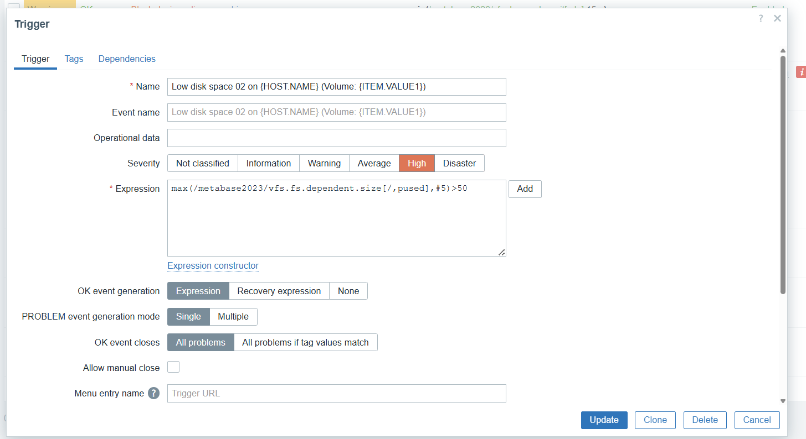

# **🧪 Jour 2 - Atelier 3 - Zabbix 7.4 \- Alerting Configuration avancée des alertes & Réduction du bruit**

**Objectif :** Configurer une chaîne d'alerte complète et robuste (Mail, Discord, Teams) avec une logique d'escalade et de filtrage des faux positifs sur un environnement Zabbix 7.4 moderne.  
**Périmètre :**

* **Agent Zabbix (Linux) :** Alerte d'espace disque intelligent.  
* **Switch Cisco (SNMP) :** Détection de coupure port et erreurs.  
* **Canaux :** E-mail, Discord, Teams.  
* **Stratégie :** Warning (Chat uniquement) vs High/Disaster (Mail \+ Chat).

## **1\. 📌 Pré-requis & Navigation Zabbix 7**

### **1.1 Hôte Linux (Agent2)**

* **Chemin :** Data collection (Collecte de données) → Hosts (Hôtes).  
* **Vérification :** L'hôte doit être "Enabled" et l'interface **ZBX** doit être verte.  
* **Template associé :** *Linux by Zabbix agent* (ou *agent 2*).

### **1.2 Switch Cisco (SNMPv2)**

* **Chemin :** Data collection → Hosts.  
* **Template :** *Cisco IOS by SNMP* (Standard moderne) ou *Network Generic Device by SNMP*.  
* **Vérification :** L'interface **SNMP** doit être verte.

## **2\. 📧 Configuration des Médias (Alerts)**

**Note :** Dans Zabbix 7, la configuration des médias se trouve désormais sous le menu "Alerts".

### **2.1 Configurer le serveur SMTP (E-mail)**

1. Aller dans : Alerts → Media types.  
2. Cliquer sur **Email** (ou le cloner pour en créer un dédié).  
3. **Paramètres :**  
   * **SMTP server :** smtp.exemple.com  
   * **Port :** 587 (ou 25/465 selon fournisseur)  
   * **Connection security :** STARTTLS (recommandé)  
   * **Authentication :** Username and password  
   * **Message format :** HTML  
4. **Onglet Message templates :** Vérifier que les templates par défaut (*Problem*, *Recovery*) sont présents.  
5. **Test :** Cliquer sur "Test" à droite de la ligne Email → Saisir votre mail → **Send**.

### **2.2 Configurer Discord & Teams (Méthode native Zabbix 7\)**

Zabbix 7 possède des connecteurs natifs plus puissants que les webhooks bruts.  
**Pour Discord :** voir également [Notice Zabbix / Discord](https://github.com/spoofingcorp/zabbix_7.4/blob/main/DIscord_config.md)

* Alerts → Media types.  
* Chercher **Discord**. S'il n'est pas là : Import (fichier XML officiel Zabbix) ou créer un nouveau type "Webhook".  
* *Si Webhook manuel simple :*  
  * **Type :** Webhook  
  * **Parameters :** Ajouter discord\_endpoint avec l'URL de votre Webhook Discord.


**Pour Teams :**

* Alerts → Media types → **MS Teams**.  
* Remplir le paramètre teams\_endpoint avec l'URL de votre connecteur Teams.

### **2.3 Associer les médias à l'utilisateur**

1. Aller dans : Users (Utilisateurs) → Users.  
2. Cliquer sur votre utilisateur (ex: Admin).  
3. Onglet **Media** → **Add**.  
   * **Type :** Email → Renseigner votre adresse.  
   * **Type :** Discord → Renseigner l'URL ou l'ID.  
   * **Type :** MS Teams → Renseigner l'URL.  
4. **Severity :** Cocher **toutes les cases** pour le moment (le filtrage se fera via les Actions).

## **3\. 🔔 Configuration des Triggers (Nouvelle Syntaxe Z7)**

### **1.1 Linux – Disque faible (Trigger intelligent)**

### **Créer le Trigger**

* **Name** : Low disk space on {HOST.NAME} (Volume: {ITEM.VALUE1})
* **Severity** : High
* **Expression (nouvelle syntaxe)** :

```
last(/metabase2023/vfs.fs.dependent.size[/,pused]) > 50
```
 


### **1.1.1 Hysteresis — Anti Flapping (faux positifs)**

Pour forcer la continuité du problème durant 5 minutes :

```
max(/metabase2023/vfs.fs.dependent.size[/,pused],#5)>50
```


✔ Cela garantit que l’espace libre **n’est jamais repassé au-dessus de 5%** durant 5 minutes.

---

## **1.2 Cisco Switch – Triggers SNMP**

### **1.2.1 Interface DOWN**

* **Name** : Interface Gi1/0/1 changed state to DOWN
* **Severity** : High
* **Expression** :

```
last(/Switch/net.if.status[ifOperStatus.10101])=2
```

### **1.2.2 Taux d’erreur élevé**

* **Name** : High error rate on interface Gi1/0/1
* **Severity** : Warning
* **Expression** :

```
min(/Switch/net.if.in.errors[ifInErrors.10101],10)>5
```

✔ Cela évite les alertes sur un pic temporaire.

---

## **1.3 Dépendances — Anti bruit massif**

> Cas : un switch tombe → éviter que 30 serveurs alertent « UNREACHABLE »

### **Sur le trigger du serveur Linux :**

* Trigger : *Zabbix Agent unreachable*
* Onglet **Dependencies** → **Add** :
  → Dépendance vers *ICMP Ping Down* du Switch/Routeur

✔ Résultat :
➡️ Si le switch tombe → **UNE seule alerte** (switch)
➡️ Les alertes serveur sont **supprimées** tant que la dépendance est active.

---

## **1.4 Recovery Expression (anti-flapping avancé)**

Définir deux seuils : haut pour problème, bas pour recovery.

### Exemple CPU :

* **Problem** :

```
last(/Host/cpu.util) > 95
```

* **Recovery** :

```
last(/Host/cpu.util) < 80
```

---

# **2. Configuration des Actions — Notifications intelligentes**

> **Chemin** : *Alerts → Actions → Trigger actions*

---

## **2.1 Action A — Incidents Critiques (Mail + Discord + Teams)**

### **Create action :**

* **Name** : Critical Alerting (High/Disaster)

### **Conditions :**

* Trigger severity = **High**
* OR Trigger severity = **Disaster**

### **Operations (step 1) :**

* Send message → User : **Admin**
* Media : **Email, Discord, MS Teams**

---

## **2.2 Action B — Incidents mineurs (Chat uniquement)**

### **Create action :**

* **Name** : Warning Alerting (Chat only)

### **Conditions :**

* Trigger severity = **Warning**

### **Operations :**

* Send message → **Admin**
* Media : **Discord uniquement**
  ❌ Pas d’Email pour éviter le bruit

---

# **3. Escalades (Escalation Steps)**

> Pour notifier plusieurs niveaux selon le temps et l’absence d’acquittement

### **Dans Action A (Critiques) :**

#### **Step 1 (immédiat)**

* Destinataire : FirstLevel
* Médias : Email + Discord

#### **Step 2 (après 10 minutes si non résolu / non ack)**

* Destinataire : SecondLevel
* Média : Email

#### **Step 3 (après 30 minutes)**

* Destinataire : Manager
* Média : SMS ou Email

---

# **4. Recovery Operations (message de résolution)**

> **Chemin** : Action → Recovery operations

### Exemple :

* Send message → FirstLevel + SecondLevel
* Sujet : `Problem resolved on {HOST.NAME}`
* Message :

```
The issue "{EVENT.NAME}" on {HOST.NAME} has been resolved.
Duration: {EVENT.DURATION}
```

✔ Permet de clôturer proprement le ticket ou l’alerte.

---

# **5. Update Operations (messages périodiques)**

> Pour rappeler périodiquement que le problème persiste

### Exemple :

* Every : 15 minutes
* Message :

```
The issue {EVENT.NAME} is still active on {HOST.NAME}. 
Last value: {ITEM.LASTVALUE}
Please take action.
```

---

# **6. Tests réels**

## **6.1 Test Linux – Disque plein**

Sur le serveur Linux :

```bash
fallocate -l 10G /tmp/fill_disk
```

Puis :

* Monitoring → Latest data → vfs.fs.size
* Trigger → PROBLEM
* Alerte → Test escalade + recovery

---

## **6.2 Test Cisco – Port DOWN**

Switch :

```
conf t
int gi1/0/1
shutdown
```

Vérifier :

* Alerte High → Email + Discord
* Recovery à l’activation

---


