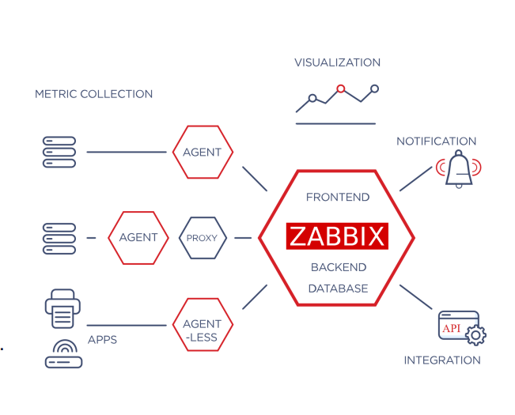
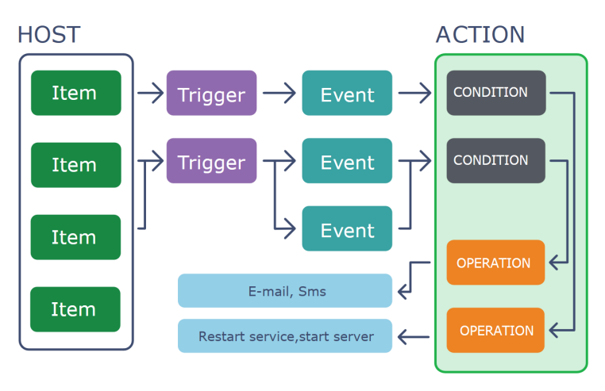
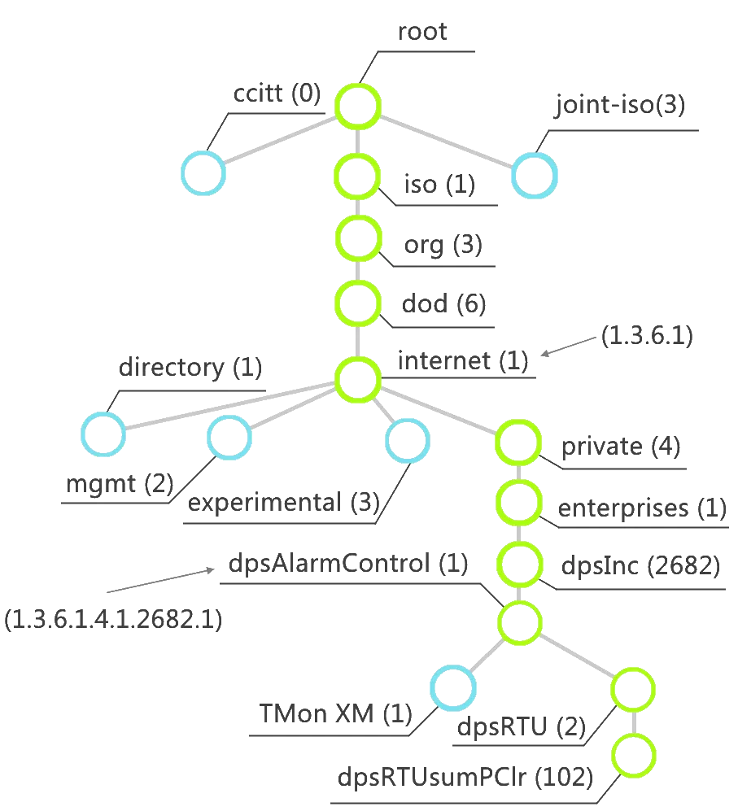
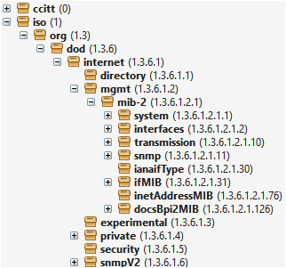

# **Manuel de Formation Complet \- Zabbix 7.4 (3 Jours)**

## **1\. Introduction à la Formation**

### **1.1. Objectifs Pédagogiques**

À la fin de cette formation, les participants seront capables de :

* Comprendre l'architecture complexe et les flux de données de Zabbix 7.0.  
* Installer et configurer un serveur Zabbix 7.0 sur Ubuntu 24.04 (PostgreSQL/Nginx).  
* Déployer et configurer Zabbix Agent et Agent 2 (passif/actif) sur Ubuntu 24.04 et Windows Server 2025\.  
* Superviser un équipement réseau (Switch Cisco) via SNMP, y compris la découverte LLD.  
* Maîtriser la création d'Items, de Triggers complexes et de dépendances.  
* Mettre en place un système d'alertes (Actions) efficace et éviter les "flapping".  
* Créer des visualisations métiers (Dashboards, Maps).  
* Comprendre (HA, SLA, Corrélation).

### **1.2. Public Cible**

Administrateurs systèmes, ingénieurs réseau, et toute personne responsable de la supervision d'une infrastructure informatique.

### **1.3. Prérequis**

* Bonnes connaissances de l'administration système Linux (ligne de commande, services).  
* Connaissances de base de Windows Server (installation de services).  
* Compréhension des concepts réseau (TCP/IP, adressage IP, ports).  
* Notions de base sur le protocole SNMP (un rappel sera fait).

### **1.4. Environnement Technique du Laboratoire**

* **Serveur Zabbix:** Zabbix 7.0 LTS sur Ubuntu Server 24.04 (Noble Numbat).  
* **Base de données:** PostgreSQL.  
* **Serveur Web:** Nginx.  
* **Cibles de supervision:**  
  * 1x Windows Server 2025 (Zabbix Agent 2).  
  * 1x Ubuntu Server 24.04 (Zabbix Agent 2).  
  * 1x Switch Cisco (SNMPv2c ou v3).

## **Jour 1 : Fondamentaux et Installation**

### **Matin : Théorie \- Les Piliers de Zabbix**

#### **Module 1 : Introduction à la Supervision**

**1.1. Les Objectifs de la Supervision** Pourquoi superviser ? La supervision n'est pas seulement "vérifier si ça marche". Elle répond à trois grands besoins métier :

1. **Garantir la Disponibilité (Proactivité) :**  
   * **Avant la panne :** Détecter les signes avant-coureurs (disque plein à 80%, CPU élevé pendant 10 min) pour agir *avant* que le service ne tombe.  
   * **Pendant la panne :** Alerter la bonne équipe, au bon moment, avec la bonne information (diagnostiquer la cause racine).  
   * **Après la panne :** Fournir les données pour l'analyse post-mortem (comprendre ce qui s'est passé).

   

2. **Mesurer la Performance :**  
   * Suivre les temps de réponse d'un site web, le débit d'une interface réseau, le nombre de transactions par seconde d'une base de données.  
   * Permet de valider que les services délivrés respectent les attentes (performances applicatives).

   

3. **Gérer la Capacité (Capacity Planning) :**  
   * En observant les tendances (tendances), on peut anticiper les besoins futurs.  
   * *Exemple :* "Au rythme actuel, le stockage de ce serveur sera plein dans 3 mois."  
   * Permet de justifier et planifier les investissements matériels ou les migrations cloud.

   

**1.2. Présentation et Historique de Zabbix**

* **Créateur :** Alexei Vladishev (Letton).  
* **Historique :**  
  * **1998 :** Début du projet comme un logiciel interne.  
  * **2001 :** Publication en Open Source.  
  * **2004 :** Sortie de Zabbix 1.0 stable.  
  * **2005 :** Création de la société Zabbix SIA.


* **Modèle Économique :** 100% Open Source. Le logiciel (serveur, agent) est entièrement gratuit, sans version "Entreprise" bridée. L'entreprise Zabbix se finance par le support professionnel, la formation, et le développement.

* **Versions :**  
  * **LTS (Long Term Support) :** Supportées 5 ans (ex: 5.0, 6.0, 7.0). À privilégier en production.  
  * **Standard :** Supportées 6 mois (ex: 6.2, 6.4). Introduisent les nouveautés.


* **Zabbix 7.0 LTS (Avril 2024\) :** Apporte des améliorations majeures sur la performance (backend Go), la haute disponibilité, les dashboards (widgets), et l'intégration (webhooks).

* **Ressources :**   
    [Documentation officielle](https://www.zabbix.com/documentation/current/en/manual/quickstart/host)  
    [Zabbix Share (partage de templates)](https://www.zabbix.com/fr/integrations)  
    [Zabbix Community (forum)](https://www.zabbix.com/forum)

  [Download Zabbix / Agent](https://www.zabbix.com/download?zabbix=7.2&os_distribution=ubuntu&os_version=24.04&components=agent&db=&ws=) 

#### **Module 2 : Architecture Zabbix 7.0**




* **Zabbix Server (zabbix\_server) :**

  * Le cerveau. Écrit en Go (depuis la 7.0, anciennement en C).


  * **Rôles :**  
    * **Pollers :** Processus qui collectent les données (agents passifs, SNMP, JMX, IPMI).  
    * **Trappers :** Processus qui écoutent (sur le port 10051\) les données envoyées par les agents actifs ou les proxies.  
    * **History Syncer :** Écrit les données collectées dans la base de données.  
    * **Timer :** Gère le temps, les maintenances, les actions.  
    * **Alerters :** Gèrent l'envoi des notifications (email, scripts, webhooks).




**Bonne Pratique :** Le serveur Zabbix ne doit faire *que* Zabbix. Ne pas installer d'autres services (serveur web, mail) dessus pour des raisons de performance.

* **Base de Données (PostgreSQL / TimescaleDB) :**  
  * Le cœur du stockage.  
  * **Stocke quoi ?**  
    * **Configuration :** Hôtes, Items, Triggers, Maps... (tout sauf l'historique).  
    * **Historique :** Les données brutes (ex: 15.2% CPU à 10:01).  
    * **Tendances :** Les données agrégées (moyenne par heure) pour garder une vision long terme sans saturer la base.

    

  **Bonne Pratique :** Utiliser **PostgreSQL** (recommandé) avec **TimescaleDB**. TimescaleDB est une extension qui optimise PostgreSQL pour les séries temporelles, résultant en des performances 10x à 100x supérieures pour les graphiques et le "housekeeping".


* **Frontend Web (Nginx \+ PHP) :**  
  * L'interface de configuration et de visualisation.  
  * Communique avec le Zabbix Server via l'API Zabbix et lit/écrit dans la base de données (pour la configuration).


* **Zabbix Agent (Agent) :**  
  * Le collecteur local sur les hôtes (Windows, Linux). Détaillé au Module 3\.


* **Zabbix Proxy (zabbix\_proxy) :**  
  * Un "mini" serveur Zabbix déporté. Il collecte les données de ses agents, les stocke localement (dans une base SQLite ou PostgreSQL), puis les envoie en *batch* au Zabbix Server principal.


  * **Cas d'usage (REX) :**


    * **Supervision distribuée :** Indispensable pour superviser des sites distants (agences bancaires, magasins) connectés par un WAN. Un proxy par site limite le trafic réseau à une seule connexion vers le central.

    

    * **Performance :** Si vous avez plus de 5 000 hôtes, le serveur Zabbix principal devient un goulot d'étranglement. On utilise des proxies pour répartir la charge de collecte, même s'ils sont dans le même datacenter.

    

    * **Réseaux isolés (DMZ) :** On place un proxy en DMZ pour collecter les données des serveurs publics. Le proxy est le seul à initier la connexion vers le Zabbix Server (en mode actif), gardant le flux DMZ \-\> LAN sécurisé et maîtrisé.

#### 

#### **Module 3 : Concepts Clés (Le Vocabulaire Zabbix)**


* **Host (Hôte) :** L'équipement à superviser (un serveur, un switch, une VM).

* **Host Group (Groupe d'hôtes) :** Un conteneur logique (ex: "Serveurs Linux", "Switchs Cisco", "Serveurs de Production").

* **Item (Métrique) :** L'élément de donnée collecté (ex: system.cpu.load). C'est la *question*.  
  * Il définit : Quoi collecter ? (la clé), À quelle fréquence ? (Update interval), Combien de temps garder l'historique ?


* **Trigger (Déclencheur) :** L'expression logique qui définit un problème. C'est le *seuil d'alerte*.  
  * *Exemple :* last(/MonServeur/system.cpu.load) \> 5


* **Problem (Problème) & Event (Événement) :**  
  * Un **Événement** est un changement d'état (Trigger passe de OK à PROBLEM).  
  * Un **Problème** est un état (le Trigger *est* en état PROBLEM).


* **Action (Alerte) :** La réaction à un événement (ex: envoyer un email, exécuter un script).

* **Template (Modèle) :** Un ensemble préconfiguré d'Items, Triggers, Graphs, LLD, etc.

**Bonne Pratique Fondamentale :** Ne **JAMAIS**, au grand jamais, lier un Item ou un Trigger directement à un Hôte. **Toujours** créer/modifier un Template et lier ce Template à l'Hôte. Cela garantit la maintenabilité et la scalabilité.

#### **Module 4 : Rappels Protocoles (SNMP)**

Le protocole SNMP (Simple Network Management Protocol) est la "langue" universelle pour superviser les équipements réseau (switchs, routeurs, imprimantes, onduleurs).

* **Concepts Clés :**  
  * **Manager (Superviseur) :** Le **Serveur Zabbix**.  
  * **Agent (Supervisé) :** Le service SNMP sur le **Switch Cisco**.  
  * **Community String (Communauté) :** Un mot de passe (en clair) en SNMP v1 et v2c.  
  * **SNMPv3 :** La version moderne et sécurisée (authentification \+ chiffrement).


* **MIB et OID :**

  1. **MIB (Management Information Base) :** Le **dictionnaire** de l'équipement. Il décrit toutes les variables disponibles sous forme d'un **arbre hiérarchique**.  
  2. **OID (Object Identifier) :** L'**adresse unique** d'une variable dans l'arbre MIB.  
     * *Exemple :* .1.3.6.1.2.1.1.1.0 \= sysDescr (Description du système).  
     * *Exemple :* .1.3.6.1.2.1.2.2.1.8.x \= ifOperStatus (État opérationnel du port x).






* **Bonne Pratique (SNMP) :**  
  * Utiliser **SNMPv3** dès que possible.  
  * Si bloqué en v2c, utiliser une **communauté complexe** (pas public ou private).  
  * Utiliser des **ACLs** sur l'équipement réseau pour que *seul* le serveur Zabbix (ou son Proxy) ait le droit d'interroger en SNMP.

### 

### **Après-midi : Pratique \- Le Baptême du Feu**

#### **Atelier 1 : Installation de Zabbix 7.4 sur Ubuntu 24.04 (PostgreSQL \+ Nginx)**

**Objectif :** Installer un serveur Zabbix 7.4 fonctionnel avec sa base de données, son interface web et son agent local.

**1\. Prérequis Système:** 

Assurez-vous que votre serveur Ubuntu 24.04 est à jour.

`sudo apt update && sudo apt upgrade -y`  
`sudo timedatectl set-timezone 'Europe/Paris'`

**2\. Suivre les indications du Git \- Jour 1** 

[Atelier Complet Zabbix 7.4 — Ubuntu 24.04](https://github.com/spoofingcorp/zabbix_7.4/blob/main/Jour%201%20-%20Zabbix%207.4%20%E2%80%94%20Guide%20complet%20d%E2%80%99installation%20\(Serveur%20%2B%20Agent%20Linux%20%2B%20Dashboard\).md)  
[Installation Serveur | Installation Agent Linux | Ajout d’Hôte | Templates | Dashboard | Vérifications | Dépannage](https://github.com/spoofingcorp/zabbix_7.4/blob/main/Jour%201%20-%20Zabbix%207.4%20%E2%80%94%20Guide%20complet%20d%E2%80%99installation%20\(Serveur%20%2B%20Agent%20Linux%20%2B%20Dashboard\).md)

**3\. Accès via l'Interface Web**

1. **Login :**  
   * **Username :** Admin (avec un 'A' majuscule)  
   * **Password :** zabbix

   

   

## 

## **Jour 2 : Déploiement de la Supervision**

### **Matin : Théorie & Pratique \- L'Agent Zabbix**

#### **Module 5 : Configuration des Hôtes**

* Démonstration de la création d'un hôte manuel.  
* Explication de l'onglet Host (Nom, Groupes, Interfaces).  
* Explication de l'onglet Templates.  
* Explication de l'onglet Macros (variables).

#### **Module 6 : Les Templates et l'Agent Zabbix 2**

**6.1. La puissance des Templates**

* Héritage : Un template peut hériter d'un autre (ex: "Template\_Windows\_SQL" hérite de "Template\_Windows\_OS").  
* Macros : Variables utilisées pour adapter un template ({$SNMP\_COMMUNITY}, {$PASSWORD\_DB}).

**6.2. L'Agent Zabbix (Zabbix Agent 2\)**

* **Zabbix Agent (Legacy) :** Écrit en C. Léger, stable.

* **Zabbix Agent 2 (Moderne) :**  
  * La nouvelle norme, utilisée dans nos ateliers.  
  * Écrit en **Go**.  
  * **Avantages :** Plus performant, gère les vérifications en parallèle (un check lent ne bloque pas les autres), et supporte un système de **plugins** (ex: plugins natifs pour PostgreSQL, MongoDB, Docker).


**6.3. Modes de Fonctionnement : Passif vs Actif**

1. **Mode Passif (Zabbix server \-\> Agent)**  
   * Le **Serveur Zabbix** contacte l'agent sur le port **TCP/10050**.  
   * Serveur : "Donne-moi la charge CPU."  
   * Agent : "Tiens : 15%."  
   * *Avantage :* Simple.  
   * *Inconvénient :* Ne fonctionne pas si l'agent est derrière un pare-feu NAT.

   

2. **Mode Actif (Agent \-\> Zabbix server)**  
   * L'**Agent Zabbix** contacte le serveur sur le port **TCP/10051**.  
   * Agent : "Bonjour, je suis WIN-DC-01. Quelles métriques dois-je te remonter ?"  
   * Serveur : "OK, voici ta liste : charge CPU, RAM, espace disque C:."  
   * Agent : "OK, voici les données : {CPU:15%, RAM:50%, C::70%}"  
   * *Avantage :* **Fonctionne à travers les pare-feu/NAT**. Bien meilleur en performance.

**Bonne pratique :** Toujours privilégier le **mode Actif** pour les serveurs. Les templates "by Zabbix agent" modernes sont majoritairement actifs.

#### **Atelier 2 : Supervision avec Zabbix Agent 2 (Ubuntu & Windows)**

**Objectif :** Ajouter un serveur Ubuntu 24.04 et un Windows Server 2025 à la supervision.

**Partie 1 : Hôte Ubuntu 24.04**

**Sur le serveur Ubuntu 24.04 à superviser :**

1. **Installation de Zabbix Agent 2**  
   `wget [https://repo.zabbix.com/zabbix/7.0/ubuntu/pool/main/z/zabbix-release/zabbix-release_7.0-1+ubuntu24.04_all.deb](https://repo.zabbix.com/zabbix/7.0/ubuntu/pool/main/z/zabbix-release/zabbix-release_7.0-1+ubuntu24.04_all.deb)`  
   `sudo dpkg -i zabbix-release_7.0-1+ubuntu24.04_all.deb`  
   `sudo apt update`  
   `sudo apt install -y zabbix-agent2`

2. **Configuration de l'Agent**  
   `sudo nano /etc/zabbix/zabbix_agent2.conf`  
   Modifiez les lignes suivantes :  
   * Server= : IP de votre **Serveur Zabbix** (pour le mode passif).  
   * ServerActive= : IP de votre **Serveur Zabbix** (pour le mode actif).  
   * Hostname= : ubuntu-web-01 (Ce nom doit être **exactement** le même que dans l'interface Zabbix).

   

3. **Démarrage et Activation du Service**  
   `sudo systemctl restart zabbix-agent2`  
   `sudo systemctl enable zabbix-agent2`  
   *(Note : Si ufw est actif, ouvrez les ports : sudo ufw allow 10050/tcp (passif) et sudo ufw allow 10051/tcp (pour la réponse active))*

**Sur l'interface Web de Zabbix :** 

1. **Ajout de l’Hôte**
   Chemin :

   ```
   Configuration > Hosts > Create host
   ```

2. **Onglet Host :**
   Paramètres :

   * **Host name :** `ubuntu-web-01`
   * **Host groups :** `Linux servers`
   * **Interfaces :** cliquez **Add**

     * Type : **Agent**
     * Adresse IP : IP du serveur Ubuntu
     * **Port : 10050**

3. **Onglet Templates :**
   Dans :

   ```
   Link new templates
   ```

   Sélectionnez :

   * **Linux by Zabbix agent**
   * Cliquez sur **Add** (lien bleu)

4. Cliquez sur **Add** (en bas de page) pour sauvegarder l’hôte.

5. **Vérification**

   * Après 1–2 minutes, l’icône **Availability** doit passer au **vert**.
   * Chemin pour consulter les données :

     ```
     Monitoring > Latest data
     ```

     Filtrez ensuite sur `ubuntu-web-01` pour voir les métriques apparaître.


**Partie 2 : Hôte Windows Server 2025**

**Sur le serveur Windows Server 2025 à superviser :**

1. **Téléchargement de l'Agent**  
   * Téléchargez l'installeur MSI du Zabbix Agent 2 (v7.0, 64-bit) depuis https://www.zabbix.com/download\_agents.

   

2. **Installation de l'Agent (MSI)**  
   1. Exécutez l'installeur.  
   2. Sur l'écran "Configuration" :  
      * Host name: WIN-DC-01 (Nom unique)  
      * Zabbix server IP/DNS: IP de votre **Serveur Zabbix**.  
      * Server or Proxy for active checks: IP de votre **Serveur Zabbix**.  
   3. Cochez Add agent location to PATH.  
   4. Terminez l'installation (l'installeur gère le service et le pare-feu).

   

3. **Vérification (Windows)**  
   * Ouvrez services.msc et vérifiez que Zabbix Agent 2 est Running.  
   * 

**Sur l'interface Web de Zabbix :** . 

**Ajout de l'Hôte**

1. Chemin :

   ```
   Configuration > Hosts > Create host
   ```

2. **Onglet Host :**

   * **Host name :** `WIN-DC-01`
   * **Host groups :** `Windows servers`
   * **Interfaces :** cliquez **Add**

     * Type : **Agent**
     * Adresse IP : IP du Windows Server
     * **Port : 10050**

3. **Onglet Templates :**

   * Liez le template : **Windows by Zabbix agent**

4. Cliquez sur **Add** pour enregistrer l’hôte.

5. **Vérification**

   * L’icône **Availability** doit passer au vert.
   * Chemin :

     ```
     Monitoring > Latest data
     ```

     Vérifiez que les données remontent depuis `WIN-DC-01`.


### 

### **Après-midi : Théorie & Pratique \- Supervision Réseau**

#### **Module 7 : Supervision Réseau (SNMP)**

* Rappel des concepts (Module 4\) : OID, MIB, Community.  
* Types d'items SNMP : snmpv1.get, snmpv2.get, snmpv3.get.  
* Configuration de la macro {$SNMP\_COMMUNITY} au niveau global ou au niveau de l'hôte.

* **Retour d'Expérience (REX) : Goulot d'étranglement SNMP**

  * *Scénario :* Un client avait 500 switchs (48 ports chacun) supervisés en SNMP. Le serveur Zabbix passait son temps à "poller" (interroger) des milliers d'OIDs, et le processus "SNMP Poller" était constamment à 100%.  
  * *Problème :* Les interrogations SNMP sont synchrones et lentes.  
  * *Solution 1 (Performance) :* Augmenter le nombre de StartSNMPPollers dans zabbix\_server.conf (ex: de 10 à 50).  
  * *Solution 2 (Architecture) :* Déployer des **Zabbix Proxies** pour répartir la charge de collecte SNMP.  
  * *Solution 3 (Zabbix 7.0+) :* Zabbix 7.0 introduit le "bulk processing" pour SNMP, améliorant grandement les performances.

#### **Atelier 3 : Supervision d'un Switch Cisco (SNMP)**

**Objectif :** Superviser un Switch Cisco en utilisant SNMPv2c.

**1\. Configuration du Switch Cisco** Accès en ligne de commande (SSH/console) à votre switch.

`// Entrer en mode configuration`  
`configure terminal`

`// Définir une "community string" SNMP en lecture seule (RO)`  
`// REX: N'utilisez jamais "public" en production !`  
`snmp-server community MaCommunauteSecurisee RO`

`// Bonne Pratique: Restreindre l'accès au serveur Zabbix`  
`// access-list 10 permit <IP_du_serveur_Zabbix>`  
`// snmp-server community MaCommunauteSecurisee RO 10`

`// Sauvegarder la configuration`  
`end`  
`write memory` 

**2\. Validation (depuis le Serveur Zabbix)** **Crucial :** Toujours tester la connectivité *avant* de configurer l'hôte.

`# Installer snmp-tools si besoin`  
`sudo apt install -y snmp-tools`

`# Lancer un snmpwalk pour tester`  
`# Remplacez <IP_SWITCH> et 'MaCommunauteSecurisee'`  
`snmpwalk -v2c -c MaCommunauteSecurisee <IP_SWITCH> system`

Si vous obtenez une réponse (sysDescr, sysName...), la communication SNMP fonctionne.

**3\. Ajout de l'Hôte dans Zabbix**

1. Configuration \> Hosts \> Create host.  
2. **Onglet Host :**  
   * Host name: SW-CISCO-01  
   * Host groups: Network devices  
   * Interfaces: Add \> SNMP. Entrez l'IP du Switch. Port 161\.

   

3. **Onglet Templates :**  
   * Liez le template Cisco IOS by SNMP.

   

4. **Onglet Macros :**  
   * Zabbix a besoin de connaître la community string.  
   * Cliquez sur Inherited and host macros.  
   * Trouvez {$SNMP\_COMMUNITY}. Cliquez Change et entrez MaCommunauteSecurisee dans Value.

   

5. Cliquez Add.

**4\. Vérification**

1. Attendez 1-2 min. L'icône Availability (colonne Availability, icône SNMP) doit passer au **vert**.  
2. Allez dans Configuration \> Hosts \> SW-CISCO-01 \> Items.  
3. **Attendez 5-10 minutes.**

#### 

#### **Module 8 : Découverte Automatisée**

**8.1. Low-Level Discovery (LLD)**

* **Problème :** Comment superviser les 48 ports d'un switch ? Ou les 10 disques d'un serveur ? Les configurer à la main est ingérable.  
* **Solution :** Le LLD. Zabbix exécute une "règle de découverte" (ex: "Découvre-moi tous les ports réseau via SNMP" ou "Découvre-moi tous les filesystems montés via l'agent").  
* Cette règle renvoie un JSON.  
* Zabbix lit ce JSON et utilise des **"Item Prototypes"** et **"Trigger Prototypes"** pour créer automatiquement les items et triggers réels pour chaque élément découvert (port, disque).  
* **Vérification :** Retournez sur SW-CISCO-01 (Latest Data). Vous devriez maintenant voir des centaines d'items créés automatiquement par LLD (ex: Interface Gi0/1: Bits received, Interface Gi0/2: Bits received, ...).

**8.2. Network Discovery**

* Permet à Zabbix de scanner une plage IP (ex: 192.168.1.0/24) à la recherche de services (SNMP, Agent Zabbix).  
* Peut automatiquement créer des hôtes et leur lier des templates.  
* **Bonne Pratique :** Utile pour un audit initial, mais peut créer du "bruit" en production. À utiliser avec précaution.

## 

## **Jour 3 : Alertes, Visualisation & Fonctions Avancées**

### **Matin : Théorie & Pratique \- Maîtriser les Alertes**

#### **Module 9 : Triggers et Problèmes**

* **Syntaxe :** last(), avg(), min(), max().  
* *Exemple 1 (Simple) :* last(/ubuntu-web-01/system.cpu.load) \> 5  
* *Exemple 2 (Temporel) :* min(/ubuntu-web-01/system.cpu.load,5m) \> 5 (CPU au-dessus de 5 pendant 5 min)  
* **Niveaux de Sévérité :** Information, Warning, Average, **High**, **Disaster**.  
* **Dépendances de Triggers :**  
  * **Problème :** Un switch tombe. Zabbix génère 50 alertes (1 pour le switch, 49 pour les serveurs derrière).  
  * **Solution :** Configurer les triggers "Serveur injoignable" pour qu'ils *dépendent* du trigger "Switch injoignable". Si le switch est en panne, les autres triggers ne s'activent pas.  
* **Bonne Pratique (Flapping) :**  
  * *Problème :* Un service oscille (UP/DOWN/UP/DOWN) et génère 20 alertes en 5 minutes.  
  * *Solution :* Utiliser l'**hystérésis** (seuils différents pour OK et PROBLEM) ou des fonctions temporelles (min(5m)).

#### **Module 10 : Actions et Alertes**

* **Media Types :** Configuration des canaux de sortie (Email, Scripts, Webhooks Slack/Teams...).  
* **Users & User Groups :** Configuration des permissions et des médias (ex: L'admin reçoit les emails, l'équipe réseau reçoit les alertes Slack).  
* **Actions :** La glue qui lie Événements et Opérations.  
  * **Conditions :** Trigger severity \= High, Host group \= Network devices...  
  * **Opérations :** Send message to user group, Execute remote script.

#### **Atelier 4 : Configuration des Alertes**

**Objectif :** Configurer Zabbix pour envoyer une alerte email en cas de problème grave.  
**1\. Média Type (Email)**

1. Allez dans Alerts \> Media types \> Email.  
2. **Onglet SMTP :** Remplissez les informations de votre serveur SMTP.  
   * SMTP server, SMTP server port, Email from...  
3. **Onglet Security :** Configurez l'authentification (StartTLS, Username/Password).  
4. Cliquez sur Update. (Utilisez mailtrap.io si vous n'avez pas de SMTP).

**2\. Configuration de l'Utilisateur (Admin)**

1. Allez dans Users \> Users \> Admin.  
2. **Onglet Media** \> Add.  
   * Type: Email  
   * Send to: votre.email@personnel.com  
   * Use if severity: Cochez toutes les sévérités (pour ce test).  
   * Cliquez Add, puis Update.

   

**3\. Création de l'Action**

1. Allez dans Alerts \> Actions \> Trigger actions \> Create action.  
2. **Onglet Action :**  
   * Name: Notification Email \- Problèmes Graves  
3. **Onglet Conditions :**  
   * Ajoutez une condition : B: Severity is greater than or equal to High  
4. **Onglet Operations :**  
   * Bloc Operations \> Add.  
   * Operation type: Send message  
   * Send to User groups: Add \> Zabbix administrators.  
   * Send only to: Email  
   * Cliquez Add (pop-up), puis Add (principal).  
   * 

**4\. Test de l'Alerte**

1. Allez sur votre machine **Ubuntu (distante)**.  
2. Arrêtez l'agent : sudo systemctl stop zabbix-agent2  
3. Retournez sur Zabbix (Monitoring \> Problems).  
4. Après 2-3 minutes, un problème "Zabbix agent is not available" (Sévérité High) devrait apparaître.  
5. Vérifiez votre boîte email, vous devriez recevoir la notification.  
6. **N'oubliez pas de redémarrer l'agent :** sudo systemctl start zabbix-agent2

#### 

#### **Module 11 : Maintenance**

* Configuration des périodes de maintenance (pour éviter les alertes lors d'opérations planifiées).  
* Types : Avec ou sans collecte de données.

### **Après-midi : Pratique & Fonctions Avancées**

#### **Module 12 : Visualisation des Données**

* **Graphs (Graphiques) :** Visualisation rapide dans Latest Data.  
* **Dashboards (Tableaux de Bord) :**  
  * Composés de **Widgets** (Problems, Graph, Map, Data overview...).  
  * Entièrement personnalisables (glisser-déposer).


* **Maps (Cartes) :**  
  * Cartographie logique ou géographique.  
  * Les icônes changent de couleur selon l'état des services.  
  * Les liens affichent des données (ex: trafic réseau).

#### **Atelier 5 : Création d'un Dashboard Personnalisé**

**Objectif :** Créer un dashboard "Vue d'ensemble du Lab".

1. Allez dans Dashboards \> All dashboards \> Create dashboard.  
2. Nommez-le : Vue d'ensemble du Lab et cliquez Apply.  
3. Cliquez sur Add widget (en haut à droite).  
   * **Widget 1 : Problèmes**  
     * Type: Problems  
     * Name: Problèmes Actuels  
     * Show: Problems only  
     * Cliquez Add.

     

4. Cliquez à nouveau sur Add widget.  
   * **Widget 2 : Graphe CPU Windows**  
     * Type: Graph  
     * Name: CPU \- Windows Server  
     * Data set \> Item pattern: Cliquez Select  
     * Host: WIN-DC-01  
     * Item: Cherchez Processor utilization et sélectionnez-le.  
     * Cliquez Add.

     

5. Cliquez à nouveau sur Add widget.  
   * **Widget 3 : Graphe Trafic Réseau Cisco**  
     * Type: Graph  
     * Name: Trafic Entrant \- Port Gi0/1  
     * Data set \> Item pattern: Cliquez Select  
     * Host: SW-CISCO-01  
     * Item: Cherchez Interface Gi0/1: Bits received (ou un port que vous savez être actif).  
     * Cliquez Add.

     

6. Réorganisez les widgets et cliquez sur Save changes.

#### **Module 13 : Fonctions Avancées (Vue d'ensemble)**

* **Haute Disponibilité (HA) :**  
  * Zabbix 7.0 intègre un mode HA natif.  
  * **Principe :** Vous installez 2 ou 3 Zabbix Servers (noeuds zabbix\_server) qui pointent vers la même BDD.  
  * Un seul noeud est Active (il collecte, traite, alerte), les autres sont Standby (ils se mettent à jour mais ne font rien).  
  * Si le noeud Active tombe, un noeud Standby prend le relais en quelques secondes.  
  * **REX :** Indispensable en production. Avant Zabbix 6.0, il fallait gérer cela avec des clusters Linux (Pacemaker/Corosync), ce qui était extrêmement complexe. L'HA natif est une révolution.


* **Services IT (SLA) :**  
  * Permet de passer d'une vision *technique* ("le CPU est haut") à une vision *métier* ("le service de messagerie fonctionne-t-il ?").  
  * **Principe :** On définit un "Service" (ex: "Service de Vente en Ligne") qui dépend de sous-services, qui eux-mêmes dépendent des triggers techniques.


  * *Exemple :*  
    * **Service Vente en Ligne (SLA Cible: 99.9%)**  
      * Dépend de : Service Web (SLA: 99.95%) \-\> (Dépend du Trigger Port 443 répond)  
      * Dépend de : Service BDD (SLA: 99.99%) \-\> (Dépend du Trigger Port 5432 répond)

      

  * **Résultat :** Zabbix calcule automatiquement le **taux de disponibilité (SLA)** du service "Vente en Ligne" et permet de générer des rapports pour la direction.


  

* **Corrélation d'Événements :**  
  * Permet de créer une intelligence dans la gestion des problèmes et de **supprimer le "bruit"**.


  * **Cas d'usage (REX) :**  
    * *Scénario :* La sauvegarde d'un serveur démarre (ex: Veeam).  
    * *Problème :* Zabbix génère 15 alertes (CPU haut, I/O disque élevées, trafic réseau saturé).  
    * *Solution (Corrélation) :* On crée une règle qui dit :

    

      1. **Condition 1 (Nouveau problème) :** "CPU haut" ou "I/O disque".  
      2. **Condition 2 (Ancien problème existe) :** "Sauvegarde Veeam en cours" (un item qui vérifie le process).  
      3. **Opération :** "Supprimer" le nouveau problème (CPU/Disque) car il est normal pendant une sauvegarde.

      

    * *Résultat :* L'admin ne reçoit aucune alerte parasite.

    

* **Mass Update (Modification de masse) & Import/Export (XML/YAML)**  
  * Présentation rapide de l'outil Mass Update pour modifier 50 hôtes d'un coup.  
  * Rappel de l'utilité de l'export XML/YAML (GitOps, partage).

#### **Module 14 : Conclusion**

* **Bonnes pratiques de maintenance de Zabbix :**  
  * Le "Housekeeper" : le processus qui nettoie la BDD (supprime l'historique \> X jours).  
  * Sauvegarde de la base de données.  
  * Sauvegarde de zabbix\_server.conf.


* **Mise à niveau (Upgrade) :** Procédure standard (stopper serveur, upgrade paquets, démarrer serveur qui met à jour la BDD).  

* **Questions / Réponses.**

